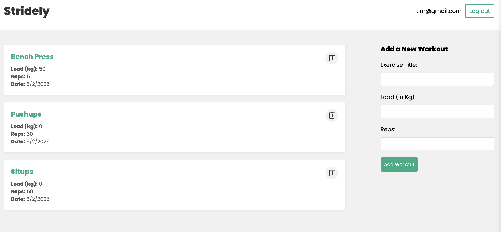
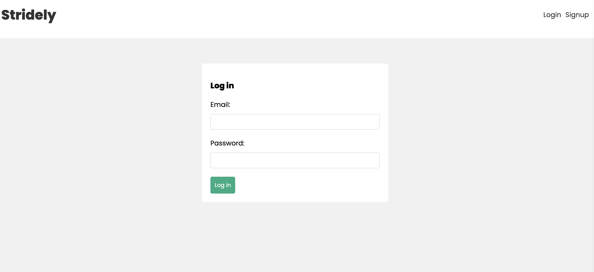

# Stridely App

This project is a MERN stack application that allows user to log and keep track of different workouts. Users can sign up, log in , and access a protected dashboard page where they can view their own, personalized workout plan.

The app uses React for the frontend, Node.js and Express for the backend, and MongoDB for the database. It demonstrates how to implement authentication and routing in a full-stack application.

## Live App URL

https://stridely.vercel.app/

## Screenshots





## Features

- **User Authentication**

  - Secure user registration and login.
  - Protected routes that require authentication to access.

- **React Router Integration**

  - Conditional navigation based on authentication status.

- **Global State Management**

  - Authentication state is managed using a custom React hook (`useAuthContext`).

- **Responsive Design**
  - Responsive UI for all devices.

## Technologies Used

### Frontend

- **React**: For building the user interface.
- **React Router**: For client-side routing.
- **CSS**: For styling the application.

### Backend

- **Node.js**: For building the server-side logic.
- **Express.js**: For handling API routes and middleware.
- **MongoDB**: For storing user data.
- **Mongoose**: For interacting with the MongoDB database.
- **JWT (JSON Web Tokens)**: For secure user authentication.

## Project Structure

### Frontend

- **/src/components**: Contains reusable components like `Navbar`.
- **/src/pages**: Contains React pages like `Home`, `Login`, and `Signup`.
- **/src/hooks**: Contains custom hooks like `useAuthContext` for managing authentication state.

### Backend

- **/routes**: Contains API routes for user authentication and workouts.
- **/middleware**: Custom middleware for authentication.
- **/server.js**: Entry point for the backend server.

## Installation

### Prerequisities

- **Node.js**: Ensure Node.js is installed on your system.
- **MongoDB**: Set up a MongoDB database (local or cloud, for example, MongoDB Atlas).

## Steps

1. Clone the repository.

```
git clone https://github.com/philipstubbs13/mern-workouts
cd mern-workouts
```

2. Navigate to the `backend` directory and install backend dependencies.

```
cd backend
npm install
```

3. Navigate to the `frontend` directory and install frontend dependencies.

```
cd frontend
npm install
```

4. Create a `.env` file in the root directory and add the following:

```
MONGO_URI=your-mongodb-connection-string
SECRET=your-jwt-secret
NODE_ENV=development
PORT=4000
```

5. In a terminal, start the backend server.

```
cd backend
npm run dev
```

6. While the backend server is still running, start the frontend in a different terminal.

```
cd frontend
npm run dev
```

7. With both the frontend and backend running, open your browser and navigate to `http://localhost: 5173`.

8. Register a new user or log in with an existing account.

9. Access the home page after logging in.

## Deployment

### Deploying to Vercel

1. Navigate to the `frontend` directory in your terminal.

2. Run the following command to create a production build.

```
npm run build
```

This will generate a `dist/` folder with static files, which will be served by the Node.js server.

3. The `vercel.json` file is already created and available in the project root folder. This file configures the Vercel deployment.

4. Install the Vercel CLI (if not already installed).

```
npm install -g vercel
```

5. Log in to Vercel.

```
vercel login
```

6. Deploy the project to production.

```
vercel --prod
```

7. Confirm deployment. After a few moments, Vercel will provide a link to your deployed application.
   Once deployed, you should be able to access both the frontend and the backend API.

For more information on deploying a MERN stack app to Vercel, see the following [article](https://medium.com/@avinashukla0704/how-to-deploy-a-combined-react-and-node-js-app-on-vercel-2cb75574cad9).
